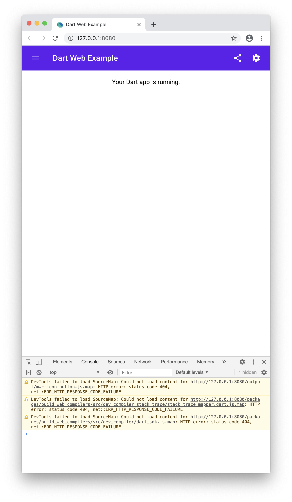

# Dart + Web Components

Online Demo: https://rodydavis.github.io/dart-material-webcomponents/

- Hot Reload
- Dart Files and Packages
- JS Files
- Html Files

To run the application run the following script:

```
scripts/run.sh
```

It will open `http://localhost:8000/` and you can hot reload changes!



To build the application run the following script:

```
scripts/build.sh
```

